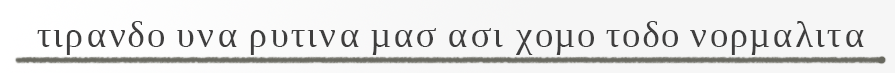

> el cuerpo humano es hermoso y tiene un sentido de ser alemnos tuvo siempre la costumbre de llevarse al extremo con tal de conseguir sobrevivir, o capaz aun mejor servir como herramienta de un depredador. Para ello el cuerpo resiste y se llega a muestras de destreza unicas de una olimpiada

De pronto tengo la sensacion de que las rutinas del cuerpo se deben adaptar a la nueva normalida, osea debe hallarse la manera de segregar tanto endorfina y otras que el cuerpo le gusta  recibir como recompensa de un ejercicio fisico osea de utilzar una fuerza

Este libro se enfoca mas que nada en registrar los pormenores de cada ejercicio con tal de hallar la tecnica correcta para mi pero como objetivo abstracto encontrar la minima lista que resuman de forma que ahorren el tiempo de aprender a los interesados en lo siguientes ejercicios

No hay mucho que decir mas que practicar pero con un alcance a largo plazo, es la dosis minima para conseguir extraer los jugos.

1. __ASHTANGA YOGA__
   1. SALUDO AL SOL A
      1. ejercicio 1
      2. ejerciocio 2
   2. SALUDO AL SOL B
      1. ejercicio 1
      2. ejerciocio 2
   3. STANDING SERIE
      1. ejercicio 1
         1. ejercicio 1
         2. ejercicio 1
      2. ejerciocio 2
         1. ejercicio 1
         2. ejercicio 1
   4. PRIMARY SERIE
      1. ejercicio 1
         1. ejercicio 1
      2. ejerciocio 2
         1. ejerciocio 2
      3. ejerciocio 2
   5. CLOSING SERIE
      1. ejercicio 1
      2. ejerciocio 2
2. __ONEPUNCH SET__
   1. CHEST 1K SET
      1. ejercicio 1
      2. ejerciocio 2
   2. ABDOMEN 1K SET
      1. ejercicio 1
      2. ejerciocio 2
   3. ESPALDA 1K SET
      1. ejercicio 1
      2. ejerciocio 2
   4. SQUADS 1K SET
      1. ejercicio 1
      2. ejerciocio 2
   5. RUNNING 10K
      1. ejercicio 1
      2. ejerciocio 2
